# Prompt Manager (나만의 프롬프트 관리 프로그램)

터미널에서 메뉴 번호를 입력해 AI 프롬프트를 저장·검색·관리하는 **콘솔 기반 프로그램**입니다.
여러 미션을 수행하며 흩어진 프롬프트를 한곳에 모아 카테고리 분류·검색·즐겨찾기로 관리하고,
Git/GitHub으로 버전 관리 전 과정을 실습한 프로젝트입니다.
필수 기능은 **외부 라이브러리 없이 Python 기본 문법만으로** 구현했습니다.

- GitHub 저장소: https://github.com/jjjoy1114/A1_1_prompt_manager
- 실행: `python prompt_manager.py` (Python 3.10 이상)

---

## 1. 개발 환경

| 항목 | 값 |
|------|-----|
| Python 버전 | Python 3.13.15 (`python --version`) |
| Git 버전 | git version 2.55.0.windows.3 (`git --version`) |
| Git 사용자 이름 | jjjoy1114 (`git config --global user.name`) |
| Git 사용자 이메일 | sadykr86@gmail.com (`git config --global user.email`) |
| 기본 브랜치 | main (`git config --global init.defaultBranch`) |
| 개발 도구 | Visual Studio Code + Python 확장 |

아래 스크린샷은 `python --version`, `git --version`, `git config`(user.name/user.email/init.defaultBranch) 출력 결과입니다.

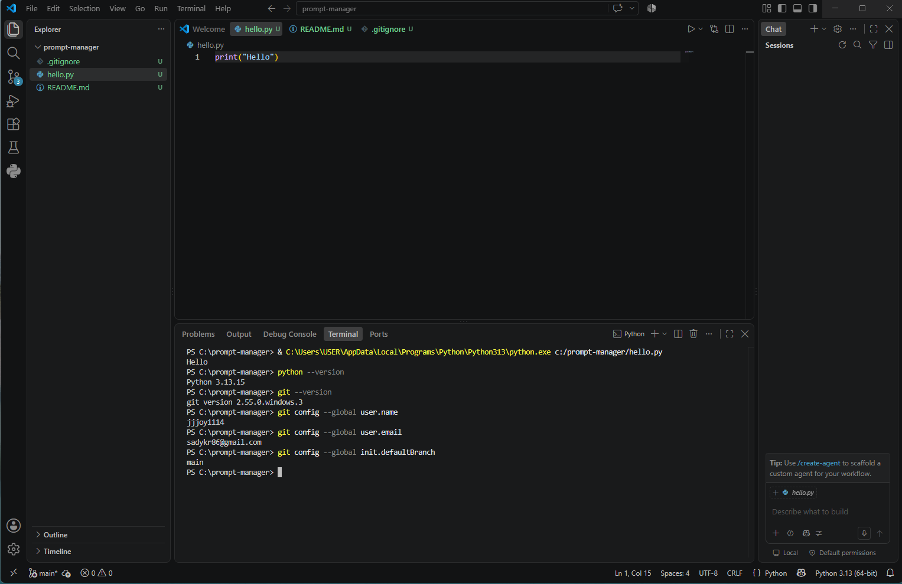

Python 파일 생성·실행 확인 (`hello.py` → `Hello` 출력):

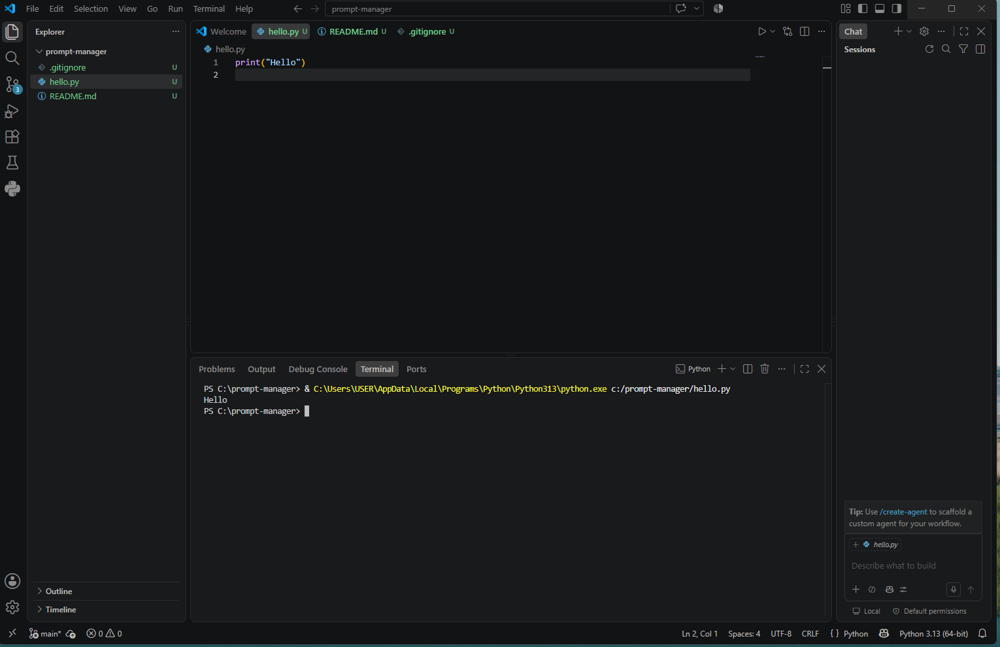

---

## 2. 실행 방법

```bash
python prompt_manager.py
```

실행하면 시작 안내 문구와 함께 메뉴가 표시되고, 번호를 입력해 기능을 선택합니다.
각 기능이 끝나면 다시 메인 메뉴로 돌아오며, `0`을 입력하면 종료됩니다.

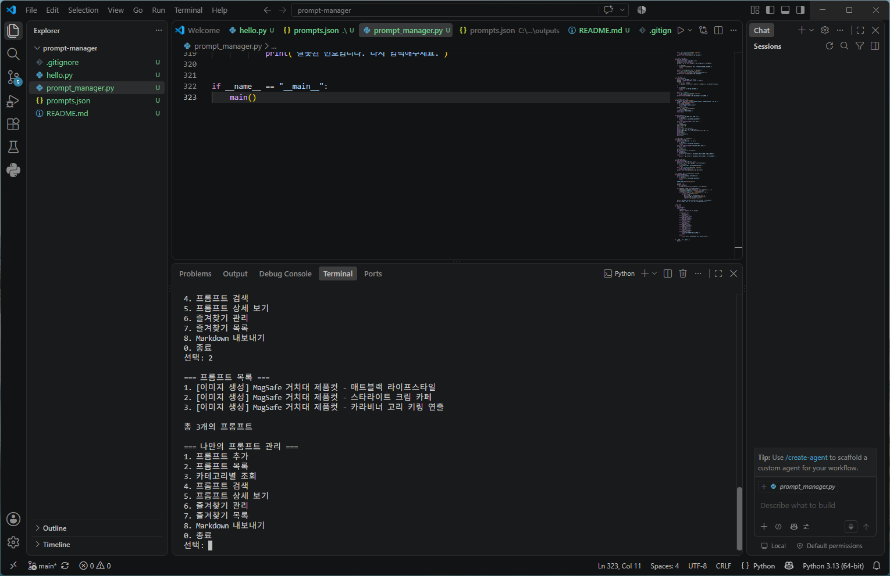

메뉴에 없는 번호(예: `9`)를 입력하면 `잘못된 번호입니다. 다시 입력해주세요.`를 출력한 뒤 메뉴를 다시 보여줍니다.

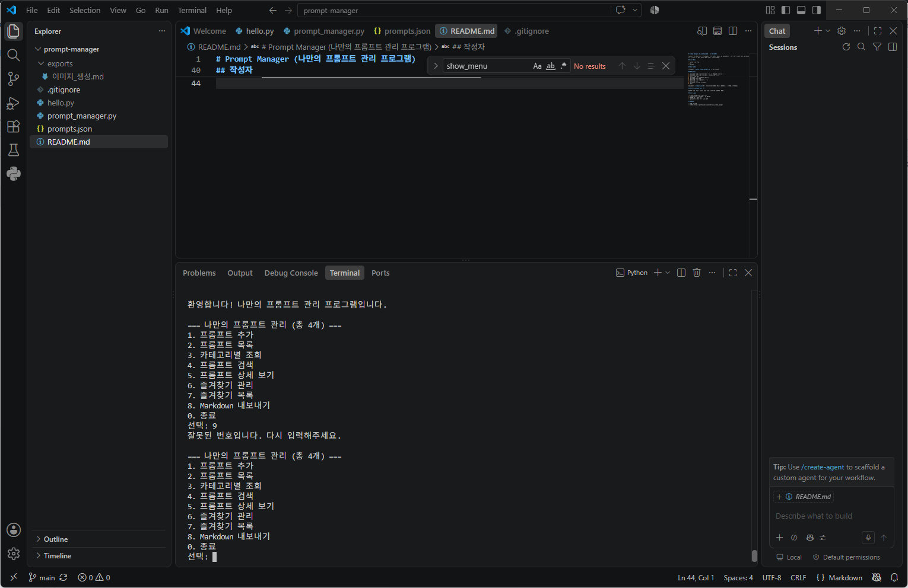

---

## 3. 기능 목록

| 번호 | 기능 | 설명 |
|------|------|------|
| 1 | 프롬프트 추가 | 제목·내용·카테고리 입력 (빈 값·중복 제목 방지) |
| 2 | 프롬프트 목록 | 번호·카테고리·제목·즐겨찾기(⭐) 표시 |
| 3 | 카테고리별 조회 | 선택 카테고리의 프롬프트만 표시 |
| 4 | 프롬프트 검색 | 제목·내용 키워드(부분 일치, 대소문자 무시) |
| 5 | 상세 보기 | 제목·카테고리·즐겨찾기·전체 내용 |
| 6 | 즐겨찾기 관리 | 번호 입력으로 추가/해제 토글 |
| 7 | 즐겨찾기 목록 | 즐겨찾기한 항목만 표시 |
| 8 | Markdown 내보내기 | 카테고리별 `.md` 파일 생성 (보너스1) |
| 0 | 종료 | `break`로 반복문 종료 |

---

## 4. 데이터 구조: 리스트 + 딕셔너리

프롬프트는 **리스트(`prompts`) 안에 딕셔너리**를 담는 구조로 관리합니다.
딕셔너리 하나가 프롬프트 하나이며, 네 개의 키를 가집니다.

```python
prompts = [
    {"title": "제목", "content": "내용", "category": "카테고리", "favorite": False},
]
```

| 키 | 저장 내용 | 자료형 |
|----|-----------|--------|
| title | 프롬프트 제목 | 문자열 |
| content | 프롬프트 내용 | 문자열 |
| category | 분류 | 문자열 |
| favorite | 즐겨찾기 여부 | 불리언(True/False) |

### 리스트 vs 딕셔너리 — 장단점 비교와 선택 이유

| 구분 | 리스트 | 딕셔너리 |
|------|--------|----------|
| 역할 | 여러 프롬프트를 순서대로 저장 | 프롬프트 1개의 정보를 이름(키)별로 저장 |
| 장점 | 번호로 순서 있게 출력·접근이 쉬움 | 제목/내용/카테고리를 키로 명확히 구분 |
| 단점 | 데이터가 많아지면 전체 순회 검색이 느려질 수 있음 | 키 이름을 정확히 써야 함 |
| 사용 예 | `prompts[0]` | `prompt["title"]` |

전체 목록 관리에는 순서가 있는 **리스트**가, 프롬프트 한 건의 여러 속성 관리에는 이름으로 접근하는 **딕셔너리**가 적합하여 둘을 함께 사용했습니다. 데이터 규모가 작고(수 개~수십 개) 초보자가 이해하기 쉬운 구조라 별도 자료구조(인덱스, DB 등)는 사용하지 않았습니다.

---

## 5. 코드 구조 — 함수 분리와 그 이유

모든 로직을 한 함수에 몰아넣지 않고 **역할 단위로 함수를 분리**했습니다. 이렇게 하면 각 기능을 독립적으로 이해·수정·재사용할 수 있고, 메뉴 번호와 함수가 1:1로 대응되어 유지보수가 쉽습니다.

| 함수 | 역할 |
|------|------|
| `show_menu()` | 메인 메뉴 출력 |
| `input_required()` | 빈 입력 방지(재입력 요청) |
| `select_category()` | 카테고리 번호 선택 또는 직접 입력 |
| `is_duplicate_title()` | 제목 중복 검사 |
| `add_prompt()` | 프롬프트 추가 |
| `show_prompt_list()` | 전체 목록 출력 |
| `show_by_category()` | 카테고리별 조회 |
| `search_prompt()` | 키워드 검색 |
| `show_detail()` | 상세 보기 |
| `toggle_favorite()` | 즐겨찾기 추가/해제 |
| `show_favorites()` | 즐겨찾기 목록 |
| `save_prompts()` / `load_prompts()` | JSON 저장/불러오기 (보너스1) |
| `export_markdown()` | 카테고리별 Markdown 내보내기 (보너스1) |
| `main()` | 메뉴 반복 및 입력에 따른 함수 호출 |

---

## 6. 입력 검증 정책

- **빈 값 방지**: `input_required()`에서 공백만 입력하면 `입력값이 비어있습니다. 다시 입력해주세요.`를 출력하고 다시 입력받습니다.
- **숫자·범위 검증**: 프롬프트 번호 입력은 `value.isdigit()`로 숫자인지 확인하고, `1 ~ 전체 개수` 범위를 벗어나면 `잘못된 번호입니다.`로 처리합니다.
- **메뉴 번호**: 0~8 외의 값은 안내 후 메뉴를 재표시합니다.
- **길이·특수문자**: 제목·내용에는 최대 길이나 허용 문자 제한을 두지 않았습니다(자유 입력). 빈 값과 중복 제목만 차단합니다. 대규모 서비스라면 길이 제한·이스케이프 처리가 필요하지만, 본 학습용 콘솔 프로그램 범위에서는 제외했습니다.

---

## 7. 카테고리

기본 카테고리: **텍스트 생성, 이미지 생성, 영상 생성, 페르소나, 자동화, 기타**

- **직접 입력 동작**: 카테고리 선택 시 목록 번호(1~6) 대신 문자열을 입력하거나 `기타`(6번)를 고르면, 입력한 이름을 그대로 카테고리로 저장합니다.
- **없는 카테고리 조회**: 선택한 카테고리에 프롬프트가 하나도 없으면 `[카테고리] 카테고리의 프롬프트가 없습니다.`를 출력하고 메뉴로 돌아옵니다.
- **카테고리 변경 시 수정 위치**: 카테고리 목록을 추가·삭제·이름 변경하려면 `prompt_manager.py` 상단의 `CATEGORIES` 리스트를 수정합니다. 이름을 바꾼 경우, 이미 저장된 `prompts.json`의 각 항목 `category` 값은 자동 변환되지 않으므로 파일에서 직접 확인·수정해야 합니다.

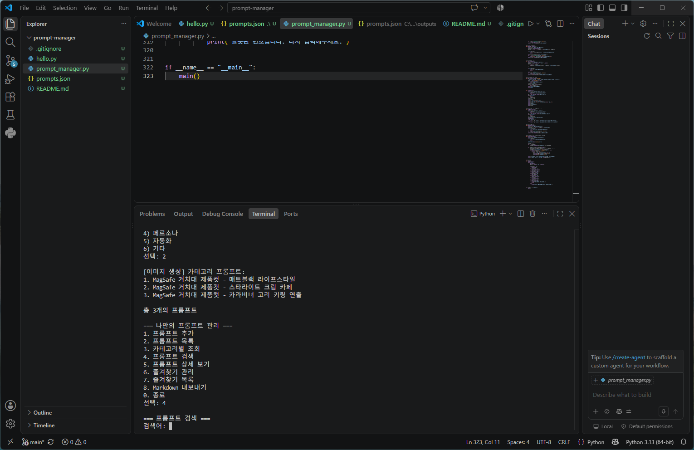

---

## 8. 검색 동작

`search_prompt()`는 검색어를 소문자로 바꾼 뒤(`lower()`) 각 프롬프트의 제목·내용에 포함되는지 검사합니다.

- **대소문자 무시**: 영문은 대소문자를 구분하지 않습니다(`MagSafe` = `magsafe`).
- **부분 일치**: 제목·내용의 일부만 포함해도 검색됩니다(예: `배낭` → "s1 아웃도어무드(배낭 결합 컷)").
- **범위**: 제목과 내용을 모두 대상으로 합니다. 토큰화·정규식·불용어 제거는 사용하지 않는 단순 부분 문자열 검색입니다.

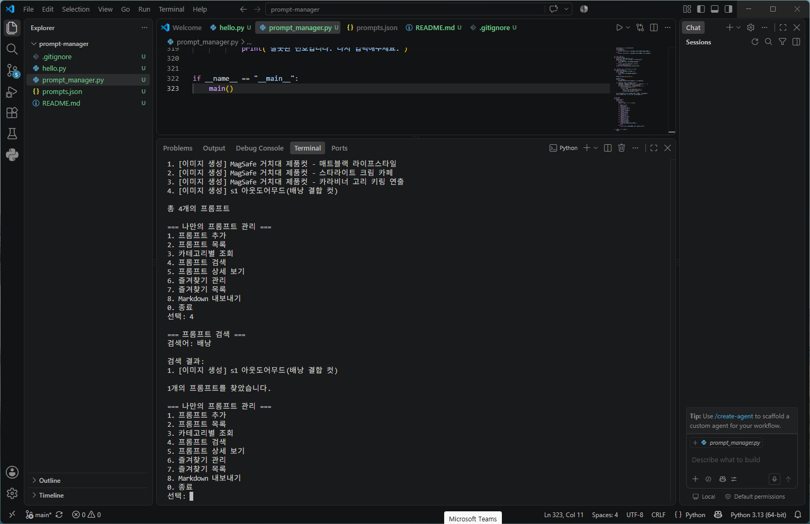

상세 보기 예시:

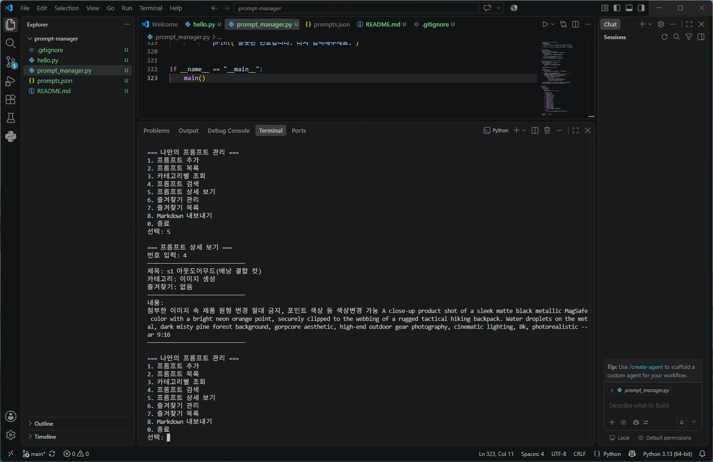

---

## 9. 즐겨찾기 · 중복 처리 정책

- **즐겨찾기 토글**: `toggle_favorite()`에서 `p["favorite"] = not p["favorite"]`로 추가/해제를 전환하고, `show_favorites()`가 `favorite == True`인 항목만 모아 보여줍니다.
- **중복 제목 정책**: `is_duplicate_title()`이 대소문자를 무시하고 제목 중복을 검사합니다. 같은 제목이 있으면 **저장을 차단**하고 다른 제목을 요청합니다(무시/덮어쓰기/자동 번호부여는 채택하지 않음 — 제목을 고유 식별자처럼 다루기 위함).

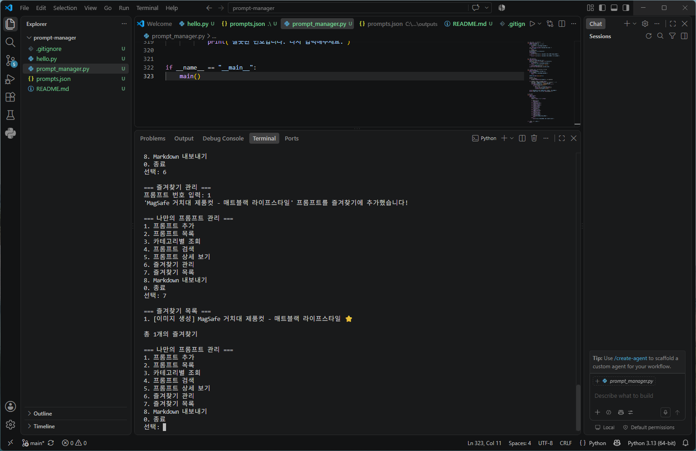

---

## 10. 데이터 저장 (보너스1) — JSON 선택 이유

프롬프트는 `prompts.json`에 저장되어 **프로그램을 종료한 뒤에도 유지**됩니다. 시작 시 `load_prompts()`가 읽고(없으면 기본값으로 생성), 추가·즐겨찾기 변경 시 `save_prompts()`가 즉시 저장합니다. `ensure_ascii=False`, `indent=2`로 한글이 깨지지 않고 보기 좋게 저장됩니다.

### JSON vs CSV vs DB — 선택 근거

| 구분 | JSON | CSV | DB(SQLite 등) |
|------|------|-----|----------------|
| 구조 | 리스트/딕셔너리를 그대로 저장 | 행·열 | 테이블 |
| 여러 줄 내용 | 관리 쉬움 | 줄바꿈 시 불편 | 가능하나 설정 필요 |
| True/False | 자료형 그대로 | 문자열처럼 보임 | 지원 |
| 도입 비용 | 표준 라이브러리로 즉시 | 간단 | 스키마·연결 필요(과함) |

제목·내용·카테고리·즐겨찾기라는 **중첩 구조**를 그대로, 외부 라이브러리 없이 저장하기에 **JSON**이 가장 적합하여 선택했습니다. CSV는 여러 줄 프롬프트·불리언 처리가 불편하고, DB는 이 규모에는 과합니다.

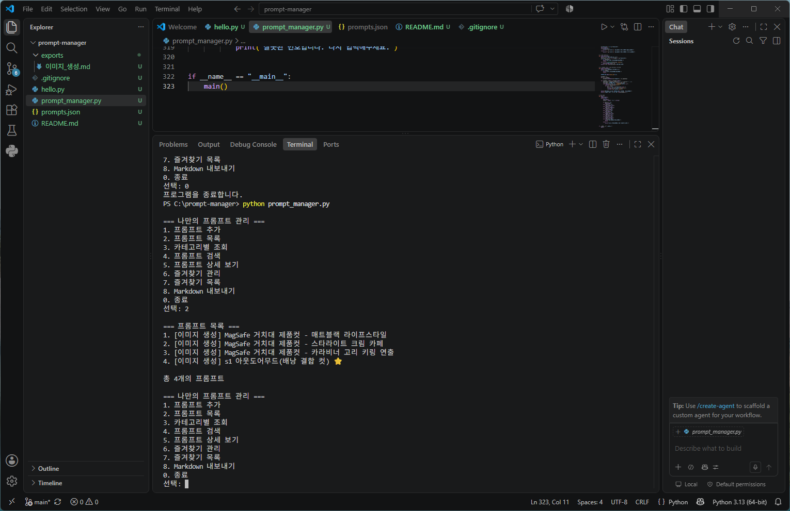

### Markdown 내보내기

`8`번을 실행하면 프롬프트를 카테고리별로 묶어 `exports/` 폴더에 `.md` 파일로 저장합니다(제목·즐겨찾기·내용 포함). `exports/`는 생성 결과물이라 `.gitignore`로 제외합니다.

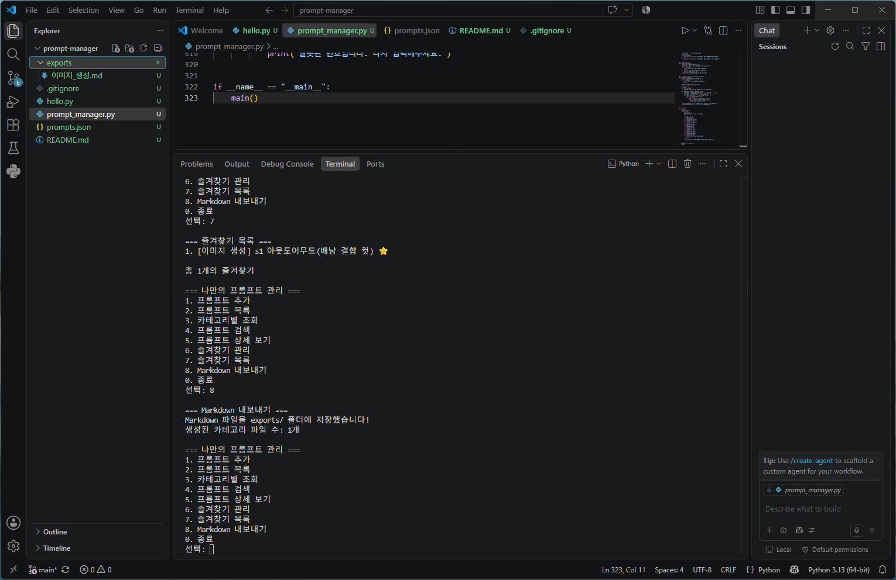

---

## 11. Git / GitHub

### 11.1 커밋 정책

- **커밋 단위**: 기능·문서·데이터 등 **의미 있는 최소 단위**로 나눕니다(한 커밋 = 한 가지 변경 목적).
- **메시지 규칙**: Conventional Commits 스타일 접두사를 사용합니다.
  - `feat:` 기능 추가 · `data:` 데이터 추가 · `docs:` 문서 · `chore:` 설정/정리 · `merge:` 병합
- 총 **11개 이상**의 커밋을 남겼습니다.

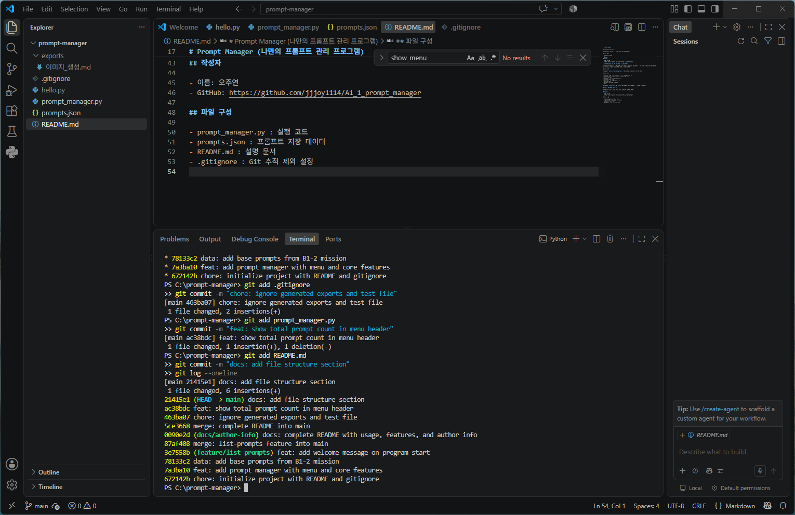

### 11.2 브랜치 전략과 병합 이력

- **분리 기준**: 기능 개발은 `feature/*`, 문서 작업은 `docs/*` 브랜치에서 진행합니다.
  - `feature/list-prompts` — 목록 기능 개선
  - `docs/author-info` — README/작성자 정보
- **병합 타이밍**: 해당 브랜치에서 기능이 **정상 동작함을 확인한 뒤** `main`으로 병합합니다.
- **병합 방식**: `git merge <브랜치> --no-ff`로 **병합 커밋**을 남겨, 그래프에 분기·병합 지점이 명확히 보이게 합니다.

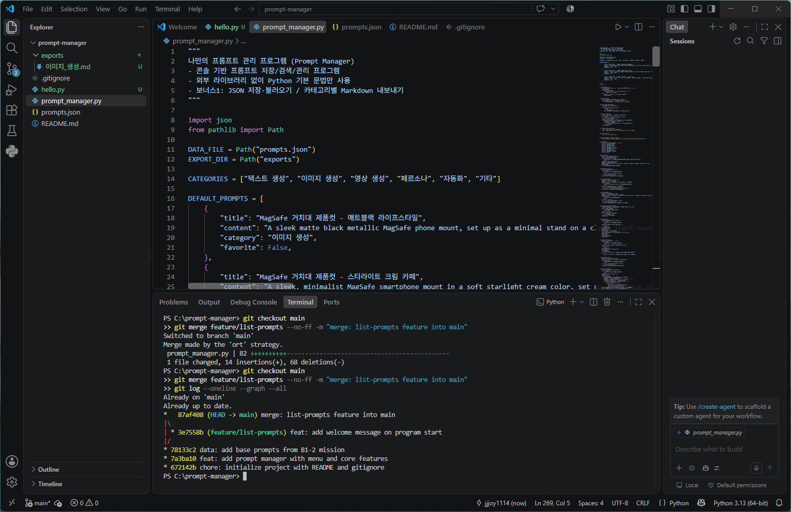

### 11.3 병합 충돌 처리 절차

동일 파일의 같은 부분을 서로 다르게 수정하면 충돌이 발생합니다. 처리 절차는 다음과 같습니다.

1. **원인 확인**: `git status`로 충돌 파일을 찾고, 파일 안의 `<<<<<<<`, `=======`, `>>>>>>>` 표시 구간을 확인합니다.
2. **해결**: 남길 내용을 정리하고 충돌 표시 기호를 삭제해 하나로 합칩니다.
3. **검증**: 프로그램을 다시 실행해 정상 동작을 확인합니다.
4. **기록**: `git add`로 해결한 파일을 스테이징하고 `git commit`으로 마무리합니다.

### 11.4 사용한 Git 명령어

`init` · `add` · `commit` · `push` · `pull` · `checkout` · `merge` · `clone`을 각 1회 이상 사용했습니다.

공개 샘플 저장소 clone 실습(`git clone https://github.com/octocat/Hello-World.git` 후 `dir`/`git log`로 폴더·이력 확인):

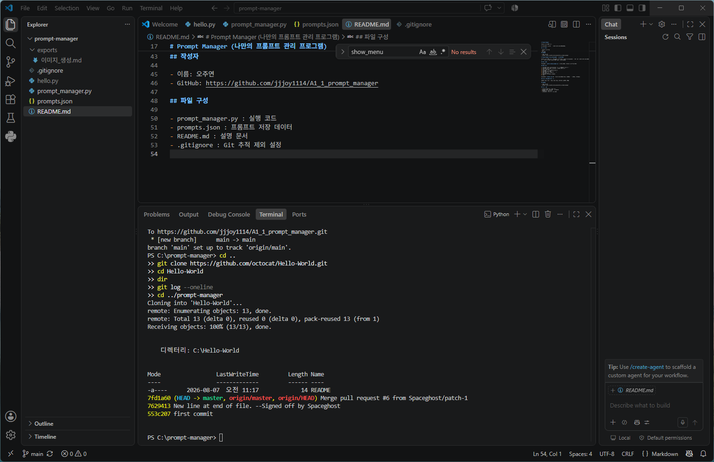

원격 변경 사항 반영(`git pull`, Fast-forward):

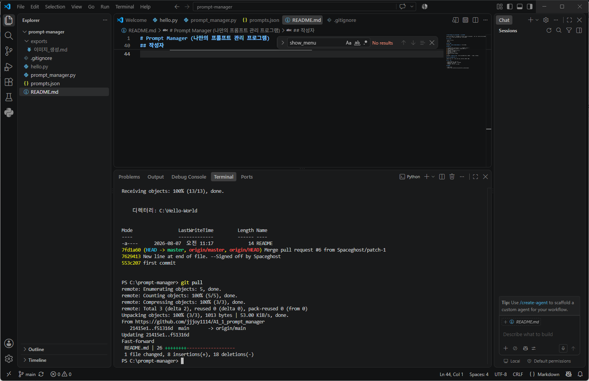

### 11.5 GitHub 업로드 결과

최종 코드를 공개 저장소 `main` 브랜치에 업로드했습니다.

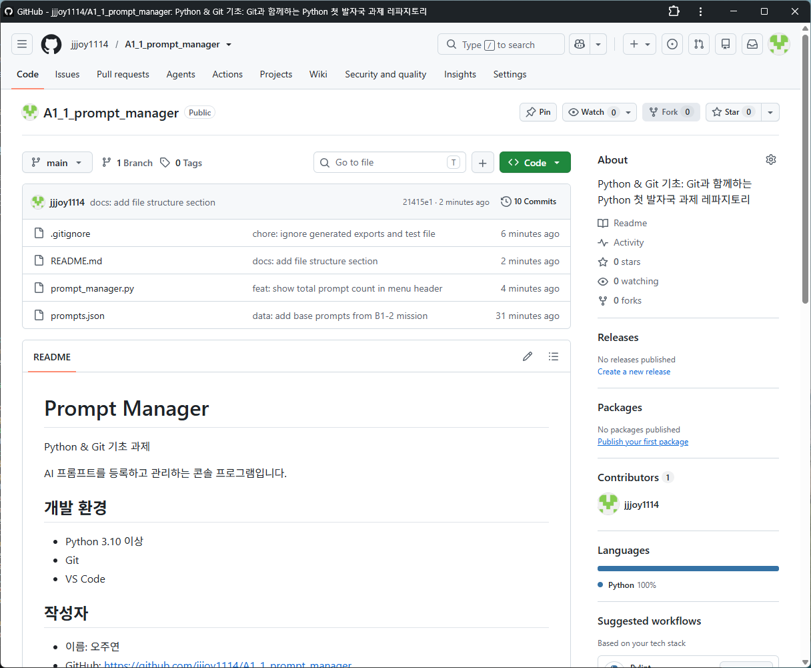

---

## 12. 종료 동작

메인 루프는 `while True`로 동작하며, `0`을 입력하면 `프로그램을 종료합니다.`를 출력하고 `break`로 종료합니다. 프롬프트 추가·즐겨찾기 변경 시점마다 이미 `prompts.json`에 즉시 저장되므로, 종료 시 별도 저장 절차 없이도 데이터가 보존됩니다.

---

## 13. 파일 구성

```
prompt-manager/
├── prompt_manager.py   # 실행 코드
├── prompts.json        # 프롬프트 저장 데이터
├── README.md           # 설명 문서
├── .gitignore          # Git 추적 제외 설정 (__pycache__, exports/, hello.py)
├── images/             # 실행 스크린샷 (보고서용)
└── exports/            # Markdown 내보내기 결과 (자동 생성, git 제외)
```

---

## 작성자

- 이름: 오주연
- GitHub: https://github.com/jjjoy1114/A1_1_prompt_manager
